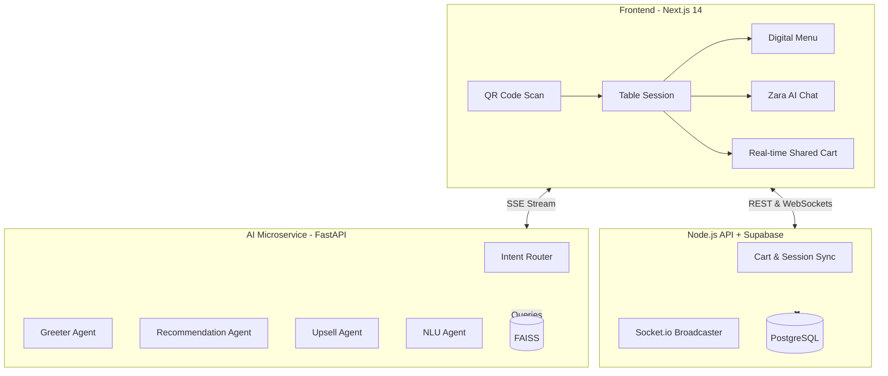

<div align="center">
  
  <h1>🍽️ Smart Dining Assistant</h1>
  <p>An AI-powered smart dining assistant that transforms the restaurant experience.</p>
  
  [](https://nextjs.org/)
  [](https://www.typescriptlang.org/)
  [](https://fastapi.tiangolo.com/)
  [](https://groq.com/)
  [](https://huggingface.co/)
</div>

<br/>

> **Smart Dining** replaces traditional tablet menus with an intelligent, multi-agent AI assistant. It supports voice-enabled ordering, real-time group table coordination, conversational checkout, and contextual upselling — all without requiring an app download or login.

## ✨ Key Features

- 💬 **Conversational AI First:** Order naturally using English, **Hinglish**, or Telugu-English. Zara (the AI) understands context and remembers preferences.
- 👨‍👩‍👧‍👦 **Real-Time Group Ordering:** Scan the table QR code. Multiple users can join the same session. Live WebSockets sync the cart instantly across devices.
- 🧠 **Contextual Upselling:** AI suggests drinks when you order mains, combos when near a milestone, and desserts after a meal.
- 🏎️ **Lightning Fast Search:** Semantic menu search using FAISS and Groq LPU inference. No hallucinations.
- 🎯 **Persistent Tracking:** Track your active orders from the main menu via a persistent sticky banner.

---

## 🏗️ System Architecture



---

## 🤖 Multi-Agent Orchestration

The backend utilizes an advanced Router-Orchestrator pattern. A fast Llama-3.3-8B model classifies intent, then dispatches the request to specialized agents powered by Llama-3.3-70B.

| Agent | Responsibility | Memory/Tools |
|---|---|---|
| **NLU Agent** | Normalizes colloquial Hinglish into strict JSON intents. | Groq (8b-instant) |
| **Recommendation Agent** | Semantic search + reasoning. Respects active filters (e.g. no dairy). | FAISS, `search_menu` |
| **Upsell Agent** | Non-pushy, contextual pairings based on current cart state. | `get_complementary` |
| **Context Memory Agent** | Tracks state ("skip dessert", "allergic to nuts") across turns. | Redis |
| **Order Validation** | Confirms stock and applies final verification pre-checkout. | `validate_stock` |

---

## 🛠️ Tech Stack

- **Frontend Framework:** Next.js 14 (App Router)
- **State Management:** Zustand
- **Real-Time Engine:** Socket.io
- **Backend APIs:** Next.js API Routes (BFF)
- **Database:** Prisma ORM connecting to Supabase PostgreSQL
- **AI Microservice:** Python 3.11, FastAPI, LangChain
- **Vector DB:** FAISS (in-memory, optimized for HuggingFace Spaces)
- **LLM Provider:** Groq (Llama-3.3-70b-versatile for logic, 8b for routing)

---

## 🚀 Quick Start (Local Development)

### 1. Frontend Setup
```bash
git clone https://github.com/kumardhruv88/smart-dining
cd smart-dining/app/src
npm install
```

### 2. Environment Variables
Create a `.env` file in the root based on `.env.example`:
```env
DATABASE_URL="your-supabase-url"
REDIS_URL="your-upstash-redis-url"
NEXT_PUBLIC_API_URL="http://localhost:3000"
```

### 3. Database Seed
```bash
npx prisma migrate deploy
npx ts-node prisma/seed.ts
```

### 4. Start Development Server
```bash
npm run dev
# App runs at http://localhost:3000/table/T1
```

> **Note on AI Backend:** The AI microservice has been moved to its own repository and deployed on HuggingFace Spaces for 24/7 availability.

---

## 🧪 Testing the Flows

| Action | How to test | Expected Result |
|---|---|---|
| **Hinglish Intent** | Type: `"kuch spicy aur light chahiye"` | AI finds low-calorie, spicy items via FAISS. |
| **Smart Cart** | Add an item to cart via chat | UI updates cart counter, Upsell agent fires. |
| **Checkout & OTP** | Type: `"order karo"` | AI asks for phone number, triggers mock OTP `123456`. |
| **Persistent Tracking** | Navigate back to menu after order | Floating "Track Active Order" pill appears. |

---

## 📄 License
MIT License. Created for the Smart Dining Assistant Internship Project.
