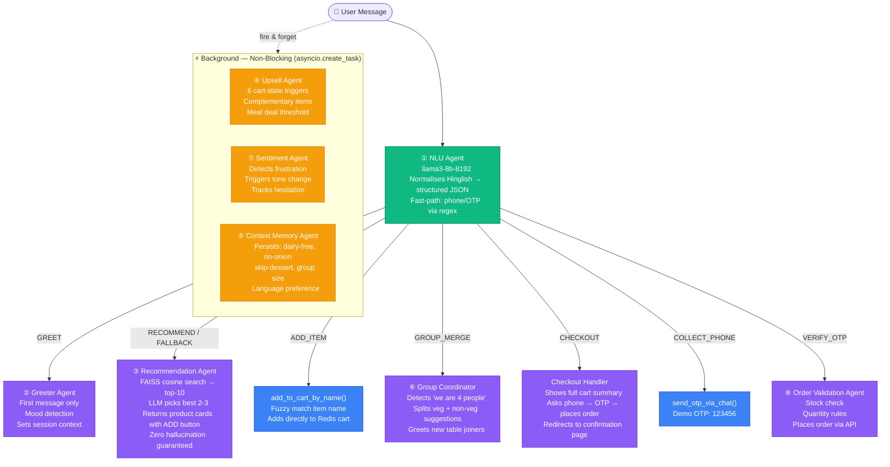
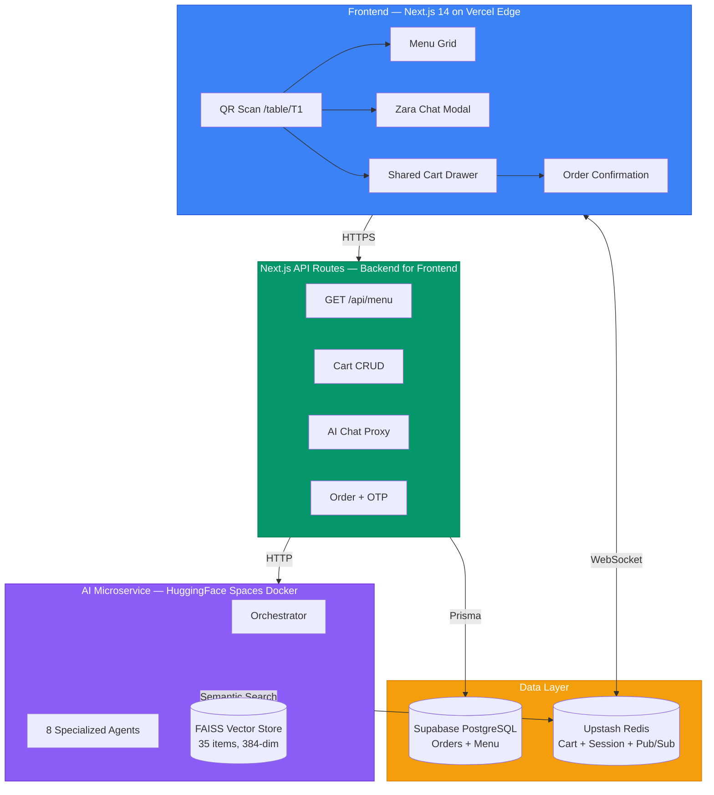

<div align="center">


# 🍽️ Smart Dining Assistant

### AI-First Restaurant Ordering — 8 Specialized Agents, Real-Time Group Sync, Hinglish NLU

</div>

---

## ⚡ Try It Live — 30 Seconds

```
🌐 Demo:  https://smart-dining-self.vercel.app/table/T1

1. Open the link (no login, no app download needed)
2. Click the orange "Z" button (bottom-right) to chat with Zara
3. Type anything — try: "kuch spicy chahiye" or "what desserts do you have?"
4. Add items to cart, then say "order karo" or click "Place Order"
5. Enter any phone number → OTP is: 123456
6. Watch the real-time order confirmation with status tracker
```

> 💡 **For group ordering:** Open the same URL (`/table/T1`) in two browser tabs simultaneously to see real-time cart sync across devices.

---

## 🎯 What I Built (3-Line Summary)

A **full-stack AI dining assistant** where every customer interaction — browsing, ordering, checkout — is handled by a multi-agent AI system (not a chatbot sidebar). Zara (the AI) understands **Hinglish and Telugu-English**, remembers preferences across the session, and can complete an entire order — from recommendation to OTP verification — purely through conversation.

**The stack:** Next.js 14 + FastAPI + LangChain + Groq (Llama-3.3-70B) + FAISS + Redis + PostgreSQL, deployed on Vercel + HuggingFace Spaces.

---

## 🤖 The 8 Agents — What Each One Does

> This is the core technical differentiator. Each agent has a **single responsibility**, its own tools, and runs independently.



---

## 🛒 How Ordering Works — Two Flows, Zero Conflict

There are **two completely independent ways** to place an order. They share the same cart but never interfere:

```
FLOW A — Traditional (Cart Button)          FLOW B — AI Chat (Zara)
─────────────────────────────────           ──────────────────────────────
Browse menu grid                            Tell Zara what you want
Click ADD on any item          ←same cart→  Zara adds item via tool call
Open Cart Drawer                            Say "order karo" or "that's all"
Click "Place Order" button                  Zara shows cart summary
Enter name + phone in modal                 Zara asks for phone number
Enter OTP: 123456                           Type your phone → Zara sends OTP
Order confirmed ✅                           Type 123456 → Order confirmed ✅
                                            Page auto-redirects ✅
```

Both flows write to the **same PostgreSQL orders table** and show the **same confirmation page**.

---

## 🧠 The Intelligence Layer — What Makes It Actually Smart

### 1. Zero Hallucination via Agentic RAG
```
User: "something light and tangy"
  ↓
Embed query → 384-dim vector (all-MiniLM-L6-v2)
  ↓
FAISS cosine search → top-10 actual menu items
  ↓
Filter by session preferences (allergens, veg/non-veg, skip categories)
  ↓
LLM picks best 2-3 WITH reasons FROM the provided list only
  ↓
Returns: {itemId, name, price, reason, imageUrl}[]
  ↓
Frontend renders clickable product cards inside chat
```
**The LLM never sees items outside the FAISS results — hallucination is structurally impossible.**

### 2. Session Memory That Actually Works
```
Turn 1: "dairy se allergy hai"    → Context Memory saves: dairy_free=true
Turn 4: "kuch filling chahiye"    → Recommendation filters out ALL dairy items ✅
Turn 7: "skip dessert"            → Memory saves: skip_dessert=true
Turn 9: "best sellers dikhao"     → Desserts never appear in results ✅
Turn 11: "place the order"        → Checkout uses phone from memory, skips re-asking ✅
```

### 3. Hinglish + Telugu-English NLU
The NLU agent (llama3-8b, fast-path regex for phone/OTP) normalises these into structured JSON before any other agent sees the message:

| User Types | Agent Sees |
|---|---|
| `"kuch teekha chahiye dairy nahi"` | `{intent: RECOMMEND, preferences: {spicy: true, dairy_free: true}, language: hinglish}` |
| `"konchem spicy ga undali veg kaadu"` | `{intent: RECOMMEND, preferences: {spicy: true, non_veg: true}, language: telugu-english}` |
| `"sumthing swt plz"` | `{intent: RECOMMEND, preferences: {sweet: true}, language: english}` |
| `"9876543210"` | `{intent: COLLECT_PHONE, entities: {phone: "9876543210"}}` |
| `"123456"` | `{intent: VERIFY_OTP, entities: {otp: "123456"}}` |

### 4. Upsell Agent — 6 Smart Triggers
The Upsell Agent runs **async (non-blocking)** after every cart change:

| When | What Zara Says |
|---|---|
| After any add-to-cart | "Most people pair {item} with {complement}. Want to add it?" |
| Cart total between ₹400-500 | "You're ₹{X} away from our Meal Deal!" |
| Mains in cart, no drink | "Looks like you're missing a drink!" |
| Only veg items, 2+ items | "Feeling adventurous? {non-veg item} is today's chef special." |
| Evening hours (4–7 PM IST) | "Evening special: {dessert} is half-price until 8 PM." |
| User says "that's all" | "Before you go — {high-margin item} takes only 5 mins..." |

---

## 🏗️ System Architecture



---

## 🛠️ Tech Stack

| Layer | Technology | Why This Choice |
|---|---|---|
| Frontend | Next.js 14 App Router | SSR + API routes as BFF in one deploy |
| State | Zustand | Lightweight, optimistic cart updates |
| Real-time | Socket.io | WebSocket abstraction for group cart sync |
| AI Framework | LangChain + FastAPI | Clean agent separation, async tools |
| LLM (responses) | Groq llama-3.3-70b-versatile | Best quality, 10x faster than OpenAI |
| LLM (routing) | Groq llama3-8b-8192 | Intent classification needs speed not creativity |
| Embeddings | all-MiniLM-L6-v2 | 384-dim, runs on CPU, zero auth needed |
| Vector DB | FAISS (in-process) | Sub-5ms search, no network roundtrip |
| Database | PostgreSQL + Prisma | Type-safe queries, Supabase hosting |
| Cache/Session | Redis (Upstash) | Cart state, preferences, WebSocket pub/sub |
| AI Deploy | HuggingFace Spaces Docker | Always-on FastAPI container |
| Frontend Deploy | Vercel Edge | Zero-config CI/CD from GitHub |

---

## 📊 Key Metrics

| What | Target | How |
|---|---|---|
| Page load (mobile 4G) | < 2s | Code-split, WebP images, CDN |
| AI first response token | < 800ms | llama3-8b for routing, stream immediately |
| AI full response | < 3s | max_tokens=250, Groq LPU speed |
| FAISS menu search | < 5ms | In-process, 35 items indexed at startup |
| Cart sync (WebSocket) | < 200ms | Redis pub/sub broadcast |
| Decision time reduction | 8 min → 2 min | AI guidance replaces browsing |

---

## 📁 Repo Structure

```
smart-dining/
├── frontend/              ← Next.js 14 (deployed on Vercel)
│   └── src/
│       ├── app/api/       ← BFF API routes (cart, order, OTP, AI proxy)
│       └── components/    ← ChatDrawer, CartDrawer, MenuGrid, SuggestionCard
│
├── smart-dining-backend/  ← FastAPI (deployed on HuggingFace Spaces)
│   ├── agents/            ← All 8 agent files
│   ├── tools/             ← cart_tools, menu_tools, checkout_tools
│   ├── memory/            ← Redis session management
│   └── main.py            ← FastAPI entry point
│
└── prisma/                ← PostgreSQL schema + 35-item menu seed
```

---

<div align="center">

**[🚀 Try the Live Demo](https://smart-dining-self.vercel.app/table/T1)** — OTP is always `123456`

*Built for the Smart Dining Assistant Internship Assignment*

</div>
