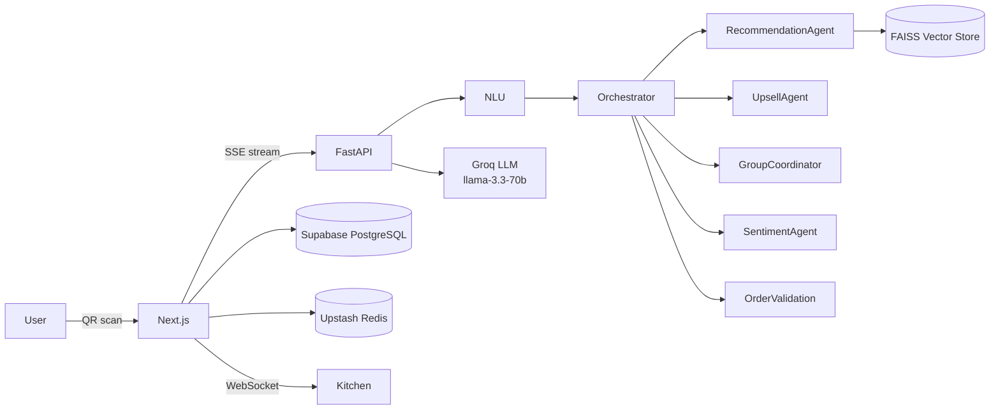

# 🍽️ Smart Dining Assistant

An AI-powered smart dining assistant that transforms the restaurant experience with intelligent multi-agent menu recommendations, voice-enabled ordering, real-time group table coordination, and conversational checkout — all without requiring a login.

> Built with: **Next.js 14 · FastAPI · LangChain · Groq · FAISS · PostgreSQL · Redis · Socket.io**

---

## 🏗️ Architecture

```
smart-dining/
├── app/                  → Next.js 14 App Router (frontend + BFF API routes)
│   ├── src/app/          → Pages (table/[tableId], confirmation)
│   ├── src/components/   → UI (ChatDrawer, CartDrawer, CheckoutModal…)
│   ├── src/app/api/      → REST API (session, cart, order, otp, menu)
│   └── src/lib/          → Utilities (otp.ts, redis.ts, session.ts…)
├── ai/                   → FastAPI Python microservice (LangChain agents)
│   ├── agents/           → 8 specialised AI agents
│   ├── tools/            → Cart, menu, checkout tools
│   ├── memory/           → Redis-backed session memory
│   └── main.py           → Streaming router + intent dispatcher
└── prisma/               → Schema + seed (30 menu items, 9 categories)
```



---

## 🤖 AI Agent Design

| Agent | Responsibility | Tools Used |
|---|---|---|
| **NLU Agent** | Classifies intent, detects language (Hinglish/Telugu-English/English), extracts entities | Groq LLM |
| **Recommendation Agent** | Semantic menu search respecting preferences, allergens, time-of-day | FAISS, search_menu |
| **Upsell Agent** | 6 trigger points: post-add, cart milestone, session time, reorder, dessert gap, drink gap | get_cart, get_complementary |
| **Context Memory Agent** | Tracks and updates user preferences throughout session | Redis, update_preference |
| **Group Coordinator** | Handles multi-person table joins, veg/non-veg split, group-safe suggestions | session tools |
| **Sentiment Agent** | Detects frustration/hesitation from consecutive signals, rephrases Zara's tone | session memory |
| **Order Validation Agent** | Validates cart pre-checkout: minimum order, stock, allergen flags | validate_stock |
| **Greeter Agent** | 2-question onboarding to seed initial context | session memory |

---

## 🛠️ Tech Stack

| Layer | Technology |
|---|---|
| **Frontend** | Next.js 14 App Router, TypeScript (strict), Vanilla CSS |
| **State** | Zustand |
| **Database** | Prisma ORM → Supabase PostgreSQL |
| **Cache / Sessions** | Upstash Redis (ioredis) |
| **Real-time** | Socket.io |
| **AI Microservice** | Python 3.11, FastAPI, LangChain |
| **LLM** | Groq (llama-3.3-70b-versatile) — fast streaming |
| **Vector Store** | FAISS (sentence-transformers embeddings) |
| **AI Deployment** | Hugging Face Spaces (Docker) |
| **Frontend Deployment** | Vercel |

---

## ⚡ Quick Start (Local)

### 1. Clone and install

```bash
git clone https://github.com/YOUR_USERNAME/smart-dining
cd smart-dining/app
npm install
```

### 2. Configure environment

```bash
cp ../.env.example .env
# Fill in: DATABASE_URL, REDIS_URL, GROQ_API_KEY
# OTP_PROVIDER=mock (use any number, OTP=123456)
```

### 3. Seed the database

```bash
npx prisma migrate deploy
npx ts-node prisma/seed.ts
```

### 4. Start the frontend

```bash
npm run dev
# → http://localhost:7564
```

### 5. Start the AI service

```bash
cd ../ai
pip install -r requirements.txt
uvicorn main:app --reload --port 7860
# → http://localhost:7860
```

### 6. Open the app

Visit: `http://localhost:7564/table/T1`

---

## 🧪 Testing the AI

Try these prompts in the chat:

| Prompt | What happens |
|---|---|
| `"kuch spicy aur light chahiye"` | Hinglish → spicy+light recommendations |
| `"konchem spicy ga undali, veg kaadu"` | Telugu-English → spicy non-veg |
| `"sumthing swt plz"` | Typo-corrected → sweet desserts |
| `"We're 4 people, 2 veg 2 non-veg"` | Group coordinator → balanced suggestions |
| `"order karo"` → number → `123456` | Full AI checkout flow |

---

## 🔑 OTP Testing

**OTP is in mock mode** — works with any phone number:

```
Phone: any 10-digit number (e.g., 9876543210)
OTP: 123456
```

All ordering logic (menu-based or AI-chat) uses the same flow.

---

## 🏗️ Design Decisions

**Why Groq instead of OpenAI?**
Groq's inference is 10-20x faster for streaming, which makes the chat feel instant. For a dining assistant where response latency matters, this is a better UX trade-off.

**Why FAISS instead of pgvector/ChromaDB?**
FAISS runs in-memory and embeds at startup, making it perfect for Hugging Face Spaces deployment where persistent volumes aren't available. Sub-5ms semantic search for a 30-item menu.

**Why Zustand instead of Redux?**
Minimal boilerplate for a focused real-time cart + chat state. The store is < 200 lines covering cart, session, messages, and modals.

---

## 📡 API Reference

| Method | Endpoint | Description |
|---|---|---|
| GET | `/api/menu` | All menu items |
| GET | `/api/menu/search?q=` | Fuzzy + tag search |
| GET | `/api/table/:tableId/session` | Create or get session |
| GET | `/api/session/:id/cart` | Get cart |
| POST | `/api/session/:id/cart` | Add item |
| PATCH | `/api/session/:id/cart/:itemId` | Update quantity |
| DELETE | `/api/session/:id/cart/:itemId` | Remove item |
| GET | `/api/session/:id/ai/stream?message=` | SSE AI stream |
| POST | `/api/otp/send` | Send OTP (mock: 123456) |
| POST | `/api/otp/verify` | Verify OTP → JWT token |
| POST | `/api/session/:id/order` | Place order |
| GET | `/api/order/:orderId` | Order status + items |

---

## License

MIT
