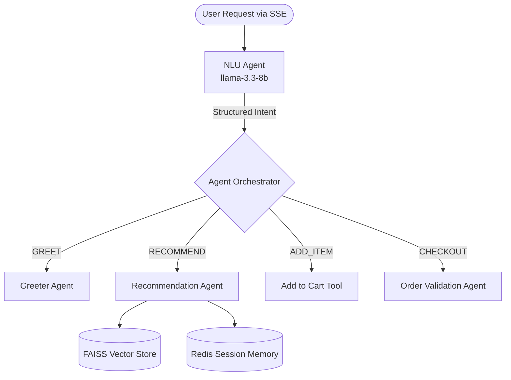

<div align="center">
  
  <h1>🧠 Smart Dining: AI Backend</h1>
  <p>The agentic microservice powering the Smart Dining Assistant.</p>
  
  [](https://python.org/)
  [](https://fastapi.tiangolo.com/)
  [](https://langchain.com/)
  [](https://groq.com/)
</div>

<br/>

> This repository contains the FastAPI microservice that handles all AI interactions for the Smart Dining Assistant. It utilizes a multi-agent orchestration pattern to understand conversational context, perform semantic menu searches, and coordinate user intent.

## 🏗️ Agent Architecture



## 🚀 Quick Start

### Prerequisites
- Python 3.11+
- A Groq API Key

### Local Setup
1. Clone the repository:
```bash
git clone https://github.com/kumardhruv88/smart-dining-backend
cd smart-dining-backend
```

2. Install dependencies:
```bash
pip install -r requirements.txt
```

3. Configure Environment Variables (`.env`):
```env
GROQ_API_KEY="your-groq-api-key"
REDIS_URL="your-upstash-redis-url"
```

4. Run the FastAPI server:
```bash
uvicorn main:app --host 0.0.0.0 --port 7860 --reload
```

## 🛠️ Key Technologies
- **FastAPI:** High-performance async API framework.
- **LangChain:** Framework for building agentic AI applications.
- **Groq (Llama-3.3-70B):** Lightning-fast LLM inference for near-instant streaming.
- **FAISS:** Local vector database for sub-5ms semantic menu searches without hallucination.
- **Redis:** Manages session memory, cart context, and user preferences.

## 📄 License
MIT License. Created for the Smart Dining Assistant Internship Project.
